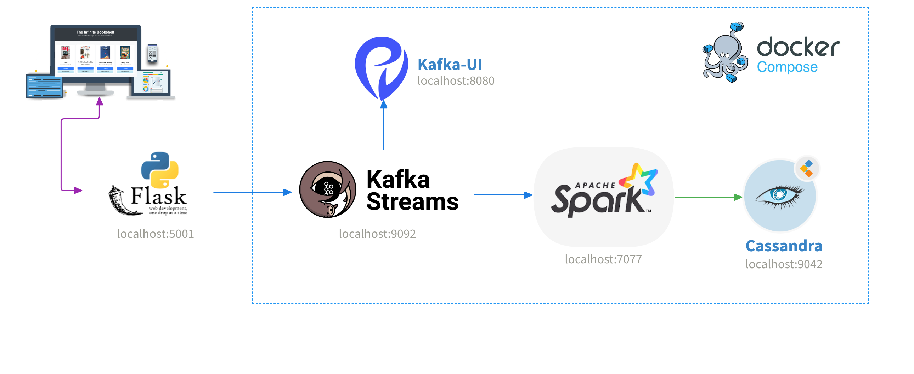
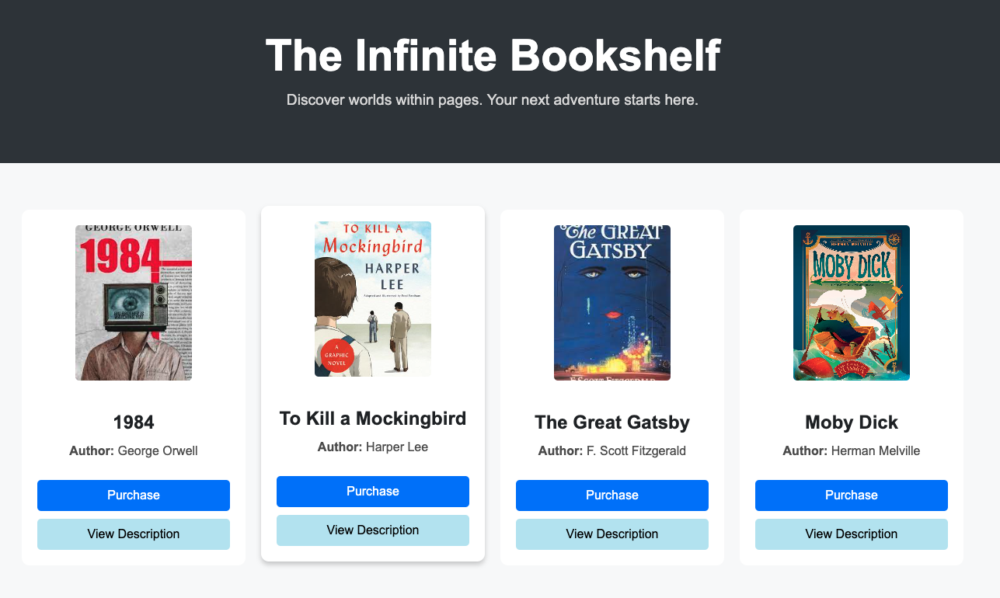
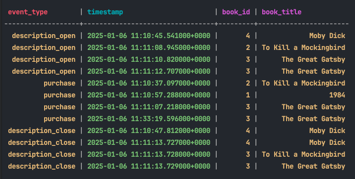

# Real-Time User Event Streaming: Bookstore Web App to Cassandra with Kafka and Spark



This project demonstrates an end-to-end pipeline for streaming user events from a Bookstore web application to Apache Cassandra using Apache Kafka and Apache Spark. The entire setup is containerized using Docker Compose for easy replication and scalability.

---

## Table of Contents
1. [Project Overview](#project-overview)
2. [Architecture](#architecture)
3. [Technologies Used](#technologies-used)
4. [Setup and Installation](#setup-and-installation)
5. [Running the Project](#running-the-project)


---

## Project Overview

The Bookstore web application, built with Flask, generates user events such as:
- `description_open`: When a user opens a book description.
- `description_close`: When a user closes a book description.
- `purchase`: When a user purchases a book.

These events are streamed to Apache Kafka, processed in real-time using Apache Spark, and stored in Apache Cassandra for persistent storage and analysis.




---

## Architecture

1. **Flask Web App**: Generates user events and publishes them to Kafka.
2. **Apache Kafka**: Acts as the message broker for streaming events.
3. **Apache Spark**: Consumes events from Kafka, processes them, and writes the results to Cassandra.
4. **Apache Cassandra**: Stores the processed events for querying and analysis.
5. **Docker Compose**: Containerizes and orchestrates all components for easy deployment.

---

## Technologies Used

- **Flask**: Python web framework for the Bookstore application.
- **Apache Kafka**: Distributed streaming platform for event streaming.
- **Apache Spark**: Real-time data processing engine.
- **Apache Cassandra**: Scalable NoSQL database for event storage.
- **Docker Compose**: Containerization and orchestration tool.

---

## Setup and Installation

### Prerequisites
1. **Docker**: Install Docker from [here](https://docs.docker.com/get-docker/).
2. **Docker Compose**: Install Docker Compose from [here](https://docs.docker.com/compose/install/).
3. **Python**: Install Python 3.9.x from [here](https://www.python.org/downloads/).

### Clone the Repository
```bash
git clone https://github.com/Igalem/Streamer.git
cd bookstore
```
### Install Python Dependencies
Install the required Python libraries for the Flask app:
```bash
pip install -r requirements.txt
```
---

## Running the Project

### 1. Start the Docker Containers
Use Docker Compose to start all services:
```bash
docker-compose up -d
```
This will start:
* Zookeeper
* Kafka
* Spark Master and Worker
* Cassandra
* Kafka UI (accessible at http://localhost:8080)

### 2. Create Kafka Topics
Create the user_events topic for streaming events:
```bash
docker exec -it kafka kafka-topics.sh --create --topic bookstore_events --bootstrap-server kafka:9092 --partitions 1 --replication-factor 1
```
### 3. Run the Flask App
Start the Flask application:
```bash
python producer/bookstore.py
```
### 4. Submit Spark Streaming Job
Run the Spark Streaming application to consume events from Kafka and process them. Submit the job to the Spark cluster.
```bash
python consumer/spark-stream-casasndra.py
```

### 5. Verify Data in Cassandra
Connect to Cassandra and query the user_events table:
```sql
USE bookstore;
SELECT * FROM events;
```



Thx! 😊
